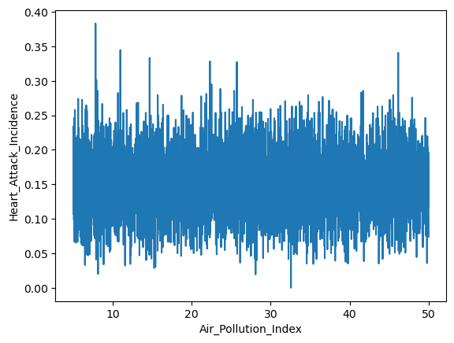
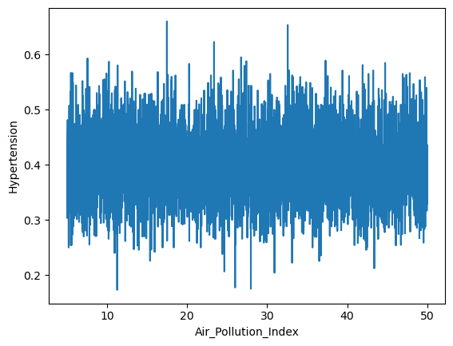

# Heart Attacks in Germany

The dataset I chose to analyze is titled: _Heart Attack in Youth Vs Adult in Germany_

## Where

I found this dataset on [kaggle](https://www.kaggle.com/datasets/ankushpanday1/heart-attack-in-youth-vs-adult-in-germany) and I liked it because the data was very clean and there was a mix of categorical and ordinal data that I could choose from. I, for the most part, disregarded that the data was specifically from German people, as I didn't think there was something about Germany that would sway heart attack statistics, however, it is important to note that all the data is specifically from German people.

I considered a few different datasets before I settled on this one, but each of them were rejected because either the data wasn't that interesting or there weren't really any visible trends or note-worthy things that I could point out. <a href="../assets/past-datasets.zip" download>The datasets I tried first</a>.

## Why

As I said, I wasn't really interested in the German states aspect of the data, however I did think the data on BMI, Alcohol Consumption, Physical Activity, Diet Quality, etc. are really interesting. I have always been interested in nutrition and fitness, and I was hoping to learn more about what things were specifically correlated with heart attacks.

There are also a bunch of other general health statistics that are not directly related to heart attacks, but still reveal important insights about health as a whole.

Specifically, I wanted to see how BMI might correlate with heart attacks as BMI is pretty controversial and not actually a great way to measure health or body composition. I also wanted to look at the impacts of smoking vs. alcohol on heart attacks and general health. 

## The Data

The variables I looked at first were the major ordinal variables (`Alcohol_Consumption`, `BMI`, `Cholesterol_Level`, and `Pollution`) against the major binary variables, meaning whether you had a certain condition or not (`Heart_Attack_Incidence`, `Diabetes`, `Hypertension`). I wanted to use the mean of the binary variables to find the percentage of people with the given condition at each interval of the ordinal variable, so when I was making the graphs, I used the following code:

```python
import matplotlib.pyplot as plt
x = "Alcohol_Consumption"
y="Heart_Attack_Incidence"

heart_attack_by_var = csv.groupby(x)[y].mean()
plot_data = heart_attack_by_var.reset_index()

sns.lineplot(
    data=plot_data,
    x=x,
    y=y,
)

plt.xlabel(x)
```
The resulting output would look like this: 

After making all the graphs, however, I realized that finding the mean was not needed and the seaborn `lineplot()` function finds the estimated mean relationship by default. And, in fact, it also displays the confidence interval around the relationship in a lighter shade of blue. 


Since I had been using that code while saving the graphs, all of the graphs displayed will be without the confidence interval. However, that isn't a major issue, as I will point out when the confidence interval is likely large, often due to sparse data.

Here are each of the major ordinal variables vs. the binary variables:

### Alcohol Consumption


### BMI


### Cholesterol Level


### Air Pollution Index






As you can see, the graphs that share the same x-axis all look pretty much the same. There doesn't seem to be any clear correlation between, say, air pollution and diabetes vs. air pollution and hypertension. In fact, for air pollution, there doesn't seem to be any trend for any of the variables-- the data points look relatively the same throughout the range of air pollution indices. Compared to graphs of cholesterol level or BMI, there doesn't seem to be a specific part of the x-axis that is more or less favorable for these conditions, in respect to air pollution.

This, I suspect, has less to do with a correlation with the data, though, and more to do with the distribution of the data. For both BMI and cholesterol level, it seems that having either an extremely low value or extremely high value results in a higher chance of having the given condition. While, at least, it seems there is more "activity" on both extremes-- the range of y values between a BMI of 5-10 or 40-50 is much larger than from 10-40. Does this mean you are more likely to get a heart attack at those extreme ranges? Maybe, but I don't think this data really confirms that.

Instead, the data is much more sparse on both of the extremes for BMI and cholesterol level, and thus the percentage of people with heart attacks or diabetes is much more sporadic. You can see that y values aren't only getting higher in the extremes but rather simply oscillating between very high and very low values. With a smaller number of people in these extreme BMI ranges, one or two heart attack incidences hold much more weight than in the more common inter-quartile range (BMI of 21.6-28.4). 

If you look at the y value that the IQR is hovering around for BMI, it is always right around the overall mean. When compared to heart attack incidence, the mean is .151 which is very close to where the middle portion is sitting. This is true for each of the graphs, regardless of whether the x-axis is BMI, cholesterol level, or alcohol consumption or whether the y-axis is heart attacks, diabetes, or hypertension. 

The sparsity of the data is also relevant for the alcohol consumption graphs, where the more alcohol consumed doesn't necessarily correlated with a higher chance of a heart attack, despite the increased activity towards the right most extreme. Especially on the very right, the data is either 1 or 0, suggesting there may only be one person at that alcohol consumption value and the percentage is effectively pointless.

To try and combat this data distribution, I wanted to group together certain ranges of the ordinal variables, so there would be more people in each x value. We are effectively doing this already, as you could measure alcohol consumption with 80 significant figures and each value would just hold one or zero people, so this approach is basically just reducing the number of significant figures for the measurement. 

## Categorical Data Bins

This is the code I used to accomplish that goal, with 10 bins for the alcohol consumption values. 

```python
import matplotlib.pyplot as plt
variable = "Alcohol_Consumption"

csv['var_bin'] = pd.cut(csv[variable], bins=5)
heart_attack_by_var = csv.groupby('var_bin')['Heart_Attack_Incidence'].mean()
plot_data = heart_attack_by_var.reset_index()

sns.barplot(
    data=plot_data,
    x='var_bin',
    y='Heart_Attack_Incidence',
)

plt.xticks(rotation=45, ha='right')
plt.xlabel(variable)
```


I used a bar chart here because now there were only 10 values on the x axis, so the line chart was no longer needed. The relationship between alcohol consumption and heart attacks seems to be clear here, however our issue of data sparsity is still relevant. There are only three people who had an alcohol consumption value of 56 or higher vs 790 people between 28 and 35. 

I tried to make the bins smaller, in an attempt to make the right most bin more voluminous, but it would never even come close to rivaling the number of people in the lower ranges. 

I had an idea to multiply the heart attack percentage by the number of people at that specific alcohol consumption value, but I didn't know what factor to use to maintain equality. If I simply multiplied by the count of people, it would completely wipe out the right side of the graph. I likely needed a certain scale factor to divide the count of people by before I multiplied, but I couldn't figure out a way to do this while still maintaining the sanctity and reliability of the data and the analysis.

Also, I know I could have potentially removed those with a extremely high/low BMI or high alcohol consumption (I am skeptical someone can even have a BMI below 10 or above 40), but that would just result in an even less interesting graph and analysis.

## Heart Attack Bar Charts


As I mentioned in the beginning, there were also quite a few categorical variables that I could use to compare to heart attack incidences. I measured each and every one of them, as seen above, but they never produced any clear correlations that were worth noting. 

## Conclusions

Honestly, I wouldn't take any of these graphs or this analysis as real world conclusions because there weren't any clear relationships that I could find. 

I am somewhat skeptical that this data is synthetic because I would expect there to be much clearer relationships or at least anything denoting a higher chance of a heart attack or diabetes or hypertension. 

It could also be the case that the data is very skewed for a particular reason or that German people are all equally likely to get a heart attack, despite all of their other traits and lifestyle habits. 

I am very skeptical.
