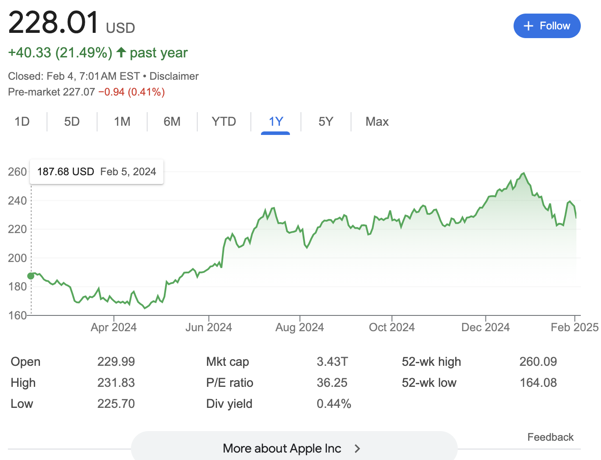
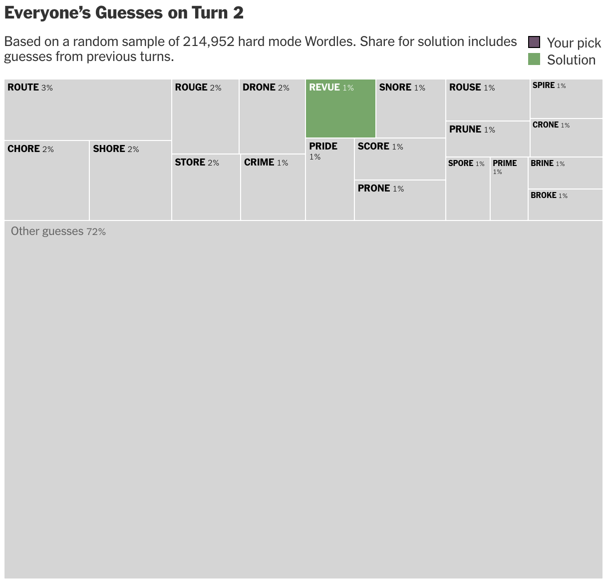
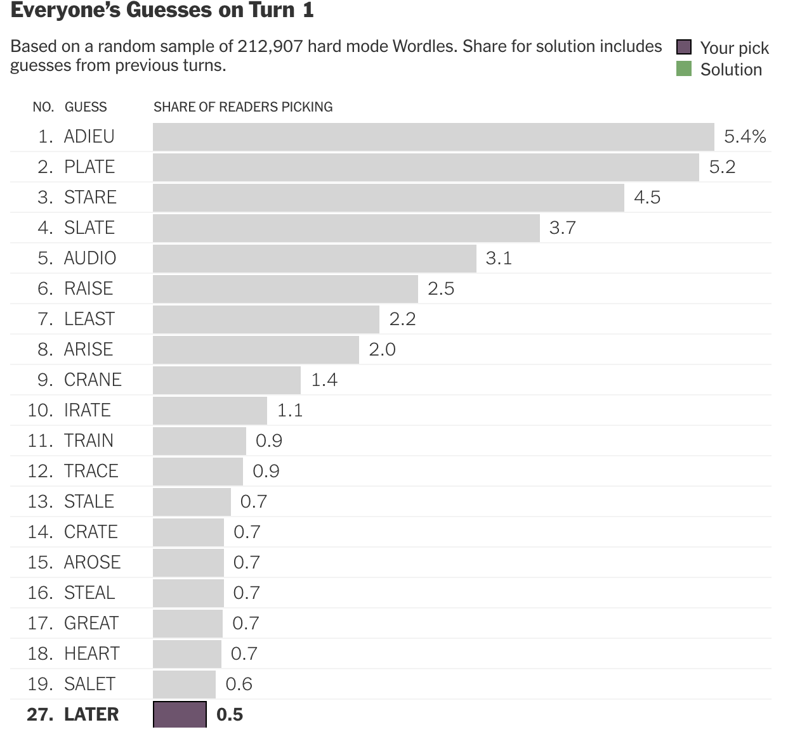

# Finding the Graphs

For a while, I had trouble finding anything that I was interested in or wanted to recreate. Everything either felt too similar and cookie-cutter, or just not interesting to me in the slightest. As a result, I looked to data visualizations that I actually find useful and have examined in my day-to-day life. They weren't necessarily the most creative or ground-breaking visualizations, but I knew, at least, that they were meaningful and they still ended up posing a challenge.

## $AAPL Stock Chart

The first chart I chose was the very standard google stock chart. I'm sure we have all seen this at some point in our lives, and I, personally, prefer it to many other platforms and brokerages. At the surface, re-making this chart is very trivial. All I have to do is make a lineplot and call it a day. But where the complexity comes in, and what I like about the Google stock charts, is that you can click and drag at any two points within the graph and you will get a specific price change and percent change for that interval. I really like this feature because it transforms the visualization from a standard one-size-fits-all graph to a customizable and malleable graph that fits your specific needs. 

The marks of the graph are the price in USD, which is displayed on the y-axis, and the time in yearmonth format, which is laid across the x-axis. The other channel is color, which is green or red depending on the price change, and maybe the tooltip if that counts. I didn't include the color change, but I did include the main feature, which is the interactive brushing across the chart. 

Here it is:

<head>
  <!-- Import Vega & Vega-Lite (does not have to be from CDN) -->
  
  
  <!-- Import vega-embed -->
  
</head>
<body>

</body>

I am really quite happy with how this graph turned out. It is basically the exact same as the original. Maybe the only thing I could add is color indicating positive or negative, but really that is a small detail in my opinion. 

I also made some other ones that aren't as good/don't really work/don't really make sense, but I still I like them:

<head>
  <!-- Import Vega & Vega-Lite (does not have to be from CDN) -->
  
  
  <!-- Import vega-embed -->
  
</head>
<body>

</body>

<head>
  <!-- Import Vega & Vega-Lite (does not have to be from CDN) -->
  
  
  <!-- Import vega-embed -->
  
</head>
<body>

</body>

## Wordle TreeMap
I remembered that a few years ago when I played Wordle day in and day out, they had released a Wordle bot which analyzes your guesses with pretty neat data visualizations. There was one in particular that I had in mind, which displayed each of the most common guesses and had them take up a certain amount of area within a larger rectangle. It looks like this: 

The marks and channels are somewhat difficult to label, I know realize, which may have contributed to my failures in recreating it. There isn't necessarily a x or y axis but the highest percent guess is in the top left and has the most area. I suppose that is a mark and a channel. Also, color is used as a channel, indicating your guess and the solution. 

I did some research and found a very similar kind of chart to this called a treemap. The only difference with a treemap was that it was hierarchial and there were categories within the graph to place the areas of data. The treemap, though, was the closest thing I could find to this type of graph. Maybe this has a different name, but I couldn't figure it out.

I tried to find a treemap chart in altair, but, unfortunately, there isn't a set way to implement them. Instead, I tried to use mark_rect(), but as you will soon see, it did not work out as I hoped. Also, rather than using wordle guesses, I instead tried to use the vega monarchs dataset and define the size based on the duration of the monarch's reign. This was also a fatal mistake. Regardless, here are my best attempts: 

<head>
  <!-- Import Vega & Vega-Lite (does not have to be from CDN) -->
  
  
  <!-- Import vega-embed -->
  
</head>
<body>

</body>

This one just only displays one box for some reason and just does not remotely work.

<head>
  <!-- Import Vega & Vega-Lite (does not have to be from CDN) -->
  
  
  <!-- Import vega-embed -->
  
</head>
<body>

</body>

And this one is not very close to the example. It is just a bar chart, but weirder and hackier and overall not very good. 

I am going to take the liberty of blaming the original graph on this one. Upon further reflection, the graph itself is just not very good. It looks cool, but it doesn't have a clear structure, axis, and the area of the guesses seems almost random. Also, it turns out that they have replaced this graph in the wordle bot interface with this new one: 

It is much clearer and makes a lot more sense to be honest. I just, personally, don't think it looks nearly as cool. 

